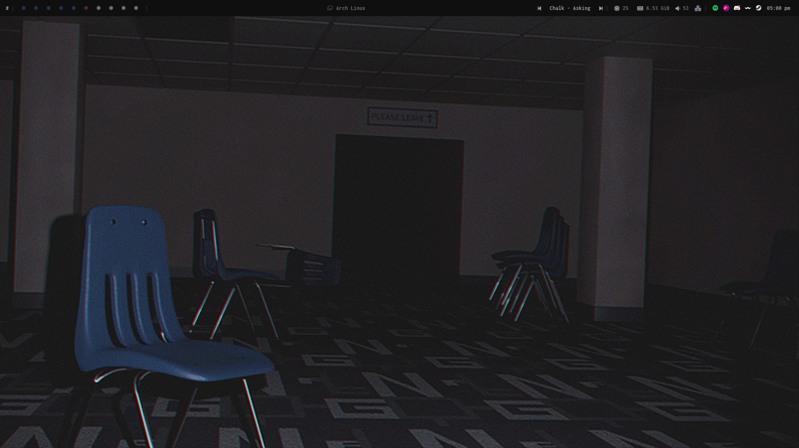
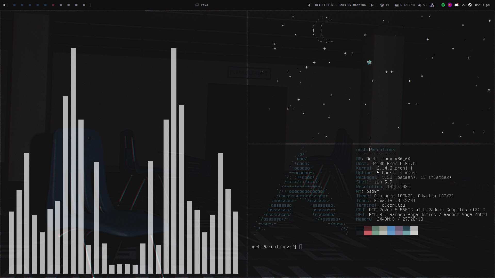

<h1 align="center">🌿 My Arch Linux Dotfiles (BSPWM Rice)</h1>

  
  

  Minimal, aesthetic, and fast. This is my first rice <strong>BSPWM</strong>.

---

## 🖥️ Desktop Overview

- Window Manager: **BSPWM**
- Panel: **Polybar**
- Launcher: **Rofi**
- Terminal: **Alacritty**
- File Manager: **Thunar + PCManFM**
- Compositor: **Picom**
- Notifications: **Dunst**
- System monitor: **btop**
- Audio visualizer: **Cava**
- Shortcuts: **sxhkd**
- Misc: **Nicotine+, TheFuck**

---

## 📸 Screenshots

---
📦 Dependencies

To use this setup properly, make sure to install:
Core
<pre>
bspwm sxhkd alacritty rofi polybar dunst picom btop cava neofetch thefuck thunar pcmanfm
</pre>
Optional / Aesthetic

feh        # Wallpaper setter
ttf-jetbrains-mono-nerd  # Nerd Font for icons
zsh + oh-my-zsh (or your shell of choice)

🚀 Installation

# Clone the repository
<pre>
git clone https://github.com/yourusername/dotfiles-bspwm.git
</pre>

# Copy configs to your .config folder
<pre>
cp -r dotfiles-bspwm/.config/* ~/.config/
</pre>
# Copy wallpapers
<pre>
cp -r dotfiles-bspwm/Wallpapers ~/Pictures/Wallpapers
</pre>
